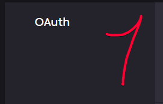
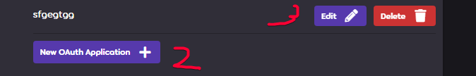

import { Steps } from '@astrojs/starlight/components';

This section will cover some of the most common questions about Sunrise, its features, and some troubleshooting tips.

## How do I set up the server?

You can find the setup guide in the [Installation](./installation) section of the documentation. It covers everything from prerequisites to running the server.

## How do I contribute to the project?

You can find the contribution guidelines in the [Contributing](../contributing) section of the documentation.

## How do I report a bug or request a feature?

You can report bugs or request features by creating an issue on the related [GitHub repository](https://github.com/SunriseCommunity) or using the [Discord server](https://discord.gg/BjV7c9VRfn).

## How can I reset the server?

Just remove all tables from the database, replace `Data` directory with a copy of `Data.Tests`, and run the server again. It will recreate all tables and populate them with default data.

## I did changes to the database, but they don't apply!

You likely have a cache issue. The server caches some data to improve performance, so if you make changes directly to the database, they might not be reflected immediately.

Use `!flushcache` chat command to flush the cache. This will force the server to fetch the data from the database.

## Can I use Akatsuki PP system?

**No.** The server uses its own PP system, which is based on the original osu! PP system. It is designed to be compatible with the original osu! client and provides a consistent experience across different servers.

## Can I use bancho.py frontends + Sunrise? Can I use bancho.py server + Sunset?

**No.** The server is designed to work with its own frontends and backends. The API is not compatible with bancho.py, and the server does not support bancho.py frontends.

## Can I use the server without Docker?

Yes, it was even done before by some users, but it's not recommended purely because of the complexity of the setup and the need to manage dependencies manually.

## Can I rollback to pre CSR (Combo Scale Removal) PP system?

Not recommended, but we have git branch with the old PP system, you can use it by checking out to the branch and building the server manually.

```bash
git checkout version/support-rosu-pp-js-2
```

:::warning
This branch is not maintained and is not recommended to use in production. Things might break, and we don't guarantee compatibility with the latest changes.
:::

Don't forget to rebuild the stack after this change.

## How to disable override of performance points for new scores with better score, but worse performance points?
You can disable it by setting `UseNewPerformanceCalculationAlgorithm` to `true` in the `General` section of the sunrise config file as follows:

```json
{
   ...
   "General": {
      "UseNewPerformanceCalculationAlgorithm": true,
      ...
   },
   ...
}
```

Don't forget to restart the server and recalculate user stats with `!recalculateuserstats all false` command.

## Where can I get `BANCHO_CLIENT_ID` and `BANCHO_CLIENT_SECRET`?

You can get `BANCHO_CLIENT_ID` and `BANCHO_CLIENT_SECRET` by registering your application on the [osu! API](https://osu.ppy.sh/home/account/edit).






You can fill in the `Application Callback URLs` field with any value, as it is not used by the server.

## How can I recalculate users PP?

It's generally not recommended to recalculate users PP frequently, but is recommended to do it after you was asked to in the changelog/release notes.

You can do it by running the following command from the superuser account to the server's bot[^1]:

```bash title="In the game chat. Please wait for the command to finish before sending another one."
!recalculatescores all 0 false
!recalculateusergrades all false
!recalculateuserstats all false
```

This will recalculate all users scores, grades and stats. It may take a while, depending on the number of users and scores in the database.

You can change all `false` values to `true` to set the server in the maintenance mode, which will prevent users from playing while the recalculation is in progress.

## How can I check server bot's[^1] commands?

You can check the server bot's[^1] commands by running the following command in the game chat:

```bash title="In the game chat"
!help
```

## I get errors about sending requests a little too fast in the game, what should I do?

Firstly, make sure you are set up the same `IGNORE_RATELIMIT_KEY` (Observatory) and `ObservatoryApiKey` (Sunrise) if you are not using Solar System orchestrator.

If you are using Solar System orchestrator, make sure you have `OBSERVATORY_IGNORE_RATELIMIT_KEY` value set up in the `.env` file.

```env
OBSERVATORY_IGNORE_RATELIMIT_KEY=your_ignore_ratelimit_key_for_observatory 
```

If you are still getting errors, you can try to update values in `API.RateLimit` section of the sunrise config file as follows:

```json
{
   ...
   "API": {
      "RateLimit": {
         "CallsPerWindow": 60, -> Number of calls allowed per window, the higher the number, the more requests user can send.
         "Window": 30 -> After which time in seconds the rate limit resets. The lower the value, the more often the rate limit resets.
      },
   }
}
```

:::warning
Be careful with increasing these values, as it can lead to server overload and performance issues.

This **can** lead to your server being restricted or even banned by osu! or beatmap mirrors, so update these values at your own risk.
:::

## How do I update the server?

### Solar System Orchestrator method

To update the server, just run `./update.sh` script in the `Solar-System` directory.

This will update all components to the latest version.

### Manual method

To update the server, you can follow these steps for all components you wish to update:

<Steps>
1. Stop the server if it's running.
2. Pull the latest changes from the GitHub repository.

   ```bash
   git fetch
   git pull
   ```

3. Rebuild the component using the docker compose command:

   ```bash
   docker compose -f docker-compose.yml up -d --build --force-recreate
   ```
</Steps>

This should update all components to the latest version.

# More Questions?

If you have more questions, feel free to ask in our [Discord server](https://discord.gg/BjV7c9VRfn).

We will keep this section updated with the most common questions and answers, so feel free to suggest any questions you think should be answered here.

[^1]: Server Bot is the always online bot account that is used to interact with the server. Similar to the [`Tillerino`](https://osu.ppy.sh/users/2070907) on Bancho. Please don't confuse it with the `BanchoBot`.