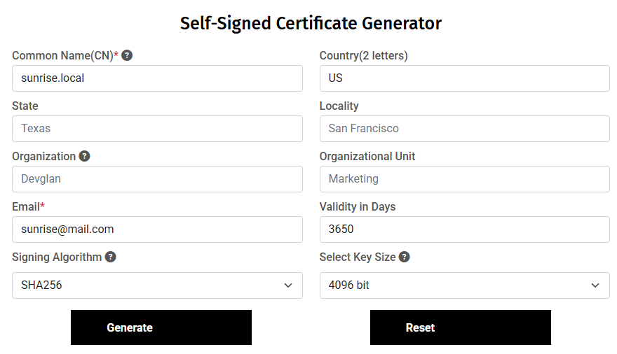
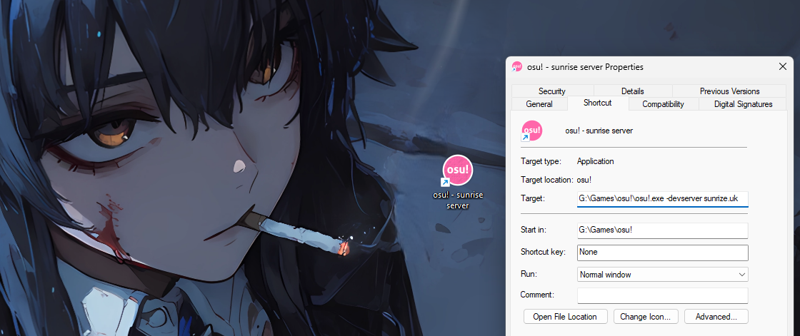
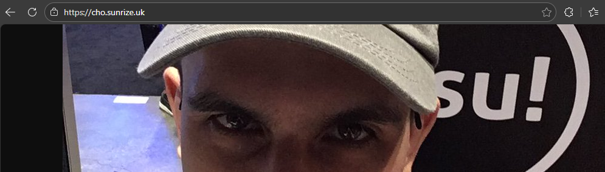

This guide walks you through setting up Sunrise server **locally** on your machine using [Solar System](https://github.com/SunriseCommunity/Solar-System) with self-signed certificates. This is useful for testing, development, or running a private server that doesn't need to be accessible from the internet.

Unlike the standard [Installation](/getting-started/installation) guide which targets a production deployment, this guide uses `docker-compose.local.yml` and the `.local` helper scripts included in Solar System.

## Prerequisites

Before you start, make sure you have the following installed on your machine:

- [Docker](https://www.docker.com/): For running the server and other components.
- [Git](https://git-scm.com/): For cloning the repositories.
- [Text Editor](https://notepad-plus-plus.org/): Optional, but recommended. Any text editor will work.
- [Administrator Privileges](https://www.howtogeek.com/343287/how-to-run-command-prompt-as-an-administrator-in-windows-10/): Required for editing the `hosts` file and installing certificates.
- [OpenSSL](https://www.openssl.org/) *(optional)*: Only needed if you want to generate certificates via the command line instead of using an online tool.

Docker will do the heavy lifting for you, so you don't need to worry about installing any technologies like Redis, MySQL, Grafana, etc.

## Setting up the Server

### 1. Cloning the Repository

First, clone the [Solar System](https://github.com/SunriseCommunity/Solar-System) repository with submodules.
Open your terminal and run the following commands:

```console
git clone --recursive https://github.com/SunriseCommunity/Solar-System.git
cd Solar-System
```

Or if you've already cloned without submodules:

```console
git submodule update --init --recursive --remote
```

### 2. Update the `hosts` File

Since you are hosting locally, your machine needs to know that `sunrise.local` and its subdomains should resolve to `127.0.0.1`.

On **Windows**, open `C:\Windows\System32\drivers\etc\hosts` with administrator privileges.
On **Linux/macOS**, open `/etc/hosts` with `sudo`.

Add the following entries at the end of the file:

```md
# Sunrise Web Section

127.0.0.1 sunrise.local
127.0.0.1 api.sunrise.local

# Sunrise osu! Section

127.0.0.1 osu.sunrise.local
127.0.0.1 a.sunrise.local
127.0.0.1 c.sunrise.local
127.0.0.1 assets.sunrise.local
127.0.0.1 cho.sunrise.local
127.0.0.1 c4.sunrise.local
127.0.0.1 b.sunrise.local
```

:::caution
Don't forget to save the file after editing it. On Windows, make sure your editor is running as Administrator.
:::

### 3. Creating Self-Signed Certificates

The local Docker Compose setup runs the Sunrise server directly on HTTPS (port 443) using Kestrel, so you need a self-signed certificate for the `sunrise.local` domain.

#### Option A: Using an online generator (recommended)

You can use an online generator to create self-signed certificates.
We recommend using [Devglan's Self-Signed Certificate Generator](https://www.devglan.com/online-tools/generate-self-signed-cert) with the following settings:

- **Common Name (CN)**: `sunrise.local`
- **Email**: `sunrise@mail.com`
- **Validity**: `3650` (10 years)
- **Signing Algorithm**: `SHA256`
- **Key Size**: `4096 bit`



After generating the certificate, click **"Download All"** to download the certificate and private key files.

Now, generate a PKCS12 file (PFX) from the downloaded files using any online converter or OpenSSL.

You can use [SSL Trust PFX File Generator](https://www.ssltrust.com.au/ssl-tools/pfx-file-generator) for this. Upload the downloaded certificate (`certificate.cer`) and private key file (`privateKey.key`) and click **"Create / Download PFX File"**.

:::caution
Remember the password you set when generating the PFX file. You will need it later for the `SUNRISE_KESTREL_CERTIFICATES_DEFAULT_PASSWORD` variable in `.env`.
:::

Rename the generated PFX file to `certificate.pfx` and move it to the `Sunrise/` directory inside Solar System:

```bash title="Final placement"
Solar-System/
├── Sunrise/
│   ├── certificate.pfx    <-- Place it here
│   └── ...
├── docker-compose.local.yml
└── ...
```

Finally, install the certificate to the **Trusted Root Certification Authorities** store so your browser and osu! client will trust it:

- **Windows**: Double-click the `certificate.cer` file and install it to the Trusted Root store, or run:
  ```console
  certutil -addstore -f "ROOT" certificate.cer
  ```
- **Linux/macOS**: Copy the `.cer` file to `/usr/local/share/ca-certificates/` and run:
  ```console
  sudo update-ca-certificates
  ```

#### Option B: Using OpenSSL (advanced)

Generate a self-signed certificate for `sunrise.local` and all its subdomains:

```console
openssl req -x509 -newkey rsa:4096 -sha256 -days 3650 -nodes \
  -keyout sunrise.local.key -out sunrise.local.crt \
  -subj "/CN=sunrise.local" \
  -addext "subjectAltName=DNS:sunrise.local,DNS:*.sunrise.local,IP:127.0.0.1"
```

Convert it to PKCS12 format (PFX) for ASP.NET:

```console
openssl pkcs12 -export -out certificate.pfx -inkey sunrise.local.key -in sunrise.local.crt -password pass:password
```

:::note
If you use `-password pass:password`, the PFX password is literally `password`. Use whatever value you prefer, just make sure it matches what you set in `.env` later.
:::

Move `certificate.pfx` to the `Sunrise/` directory:

```bash title="Final placement"
Solar-System/
├── Sunrise/
│   ├── certificate.pfx    <-- Place it here
│   └── ...
├── docker-compose.local.yml
└── ...
```

Import the certificate to the Trusted Root store:

- **Windows**:
  ```console
  certutil -addstore -f "ROOT" sunrise.local.crt
  ```
- **Linux/macOS**:
  ```console
  sudo cp sunrise.local.crt /usr/local/share/ca-certificates/sunrise.local.crt
  sudo update-ca-certificates
  ```

### 4. Configuring Sunrise

Create copies of the example configuration files:

```console
cp .env.example .env
cp Sunrise.Config.Production.json.example Sunrise.Config.Production.json
```

:::tip
If you are on Windows and don't have `cp`, you can just copy/rename the files in File Explorer.
:::

Open the `.env` file and make sure to set the following values:

```env
WEB_DOMAIN=sunrise.local
SUNRISE_KESTREL_CERTIFICATES_DEFAULT_PASSWORD=password
```

:::caution
`WEB_DOMAIN` **must** be set to `sunrise.local` (or whatever domain you used in your hosts file and certificate).

`SUNRISE_KESTREL_CERTIFICATES_DEFAULT_PASSWORD` **must** match the password you used when generating the PFX certificate file.
:::

Fill in the rest of the required parameters in both `.env` and `Sunrise.Config.Production.json`.

:::tip
You can customize the configuration files to match your requirements. For example, in `Sunrise.Config.Production.json` you can change the bot username:

```json
"Bot": {
  "Username": "Librarian Bot",
  ...
}
```
:::

### 5. Generate API Keys

Generate the token secret for Sunrise API requests:

```console
chmod +x lib/scripts/generate-api-sunrise-key.sh
./lib/scripts/generate-api-sunrise-key.sh
```

Generate the Observatory API key:

```console
chmod +x lib/scripts/generate-observatory-api-key.sh
./lib/scripts/generate-observatory-api-key.sh
```

:::tip
If you are using **Windows**, use the `.bat` equivalent scripts located in the same folder.
:::

:::note
If you want Sunrise to use the Bancho API **(highly recommended)**, fill `OBSERVATORY_BANCHO_CLIENT_ID` and `OBSERVATORY_BANCHO_CLIENT_SECRET` in `.env`. 

If you don't know how to get these values, follow the instructions in the [FAQ](/docs/faq#where-can-i-get-bancho_client_id-and-bancho_client_secret) section.
:::

### 6. Running the Server

Now that everything is configured, start the server using the **local** scripts:

```console
chmod +x ./start.local.sh
./start.local.sh
```

:::tip
If you are on Windows, use `.\start.local.bat` instead.
:::

The script will use `docker-compose.local.yml` automatically and prompt you whether to build the containers. On first run, choose **yes** to build everything.

You can verify that all containers are running with:

```console
docker ps
```

## Accessing the Server

Unlike the production setup, the local setup does **not** require Caddy or any external reverse proxy. The Sunrise server handles HTTPS directly via Kestrel on port 443.

### Connecting to the Server using osu! Client

Add a launch argument `-devserver sunrise.local` to your osu! shortcut:

```console
-devserver sunrise.local
```

After that, launch the osu! client and you should be able to connect to the server.



### Opening the Website

Sunset is included in Solar System and starts automatically with the local stack.

By default you can access the website at `http://localhost:3090`.

:::note
The local Docker Compose sets `NODE_TLS_REJECT_UNAUTHORIZED=0` for Sunset, which allows it to communicate with the Sunrise server over the self-signed certificate. This is expected for local setups.
:::

### Checking the Server Status

You can test the server connection by navigating to `https://cho.sunrise.local` in your browser.



You should see the face of a beautiful mister. :) :tada:

### Monitoring with Grafana

Grafana is included in the local stack. You can access it at `http://localhost:3060` (or whatever port you set for `GRAFANA_PORT` in `.env`).

On the first login, use `admin` as both the username and password. You will be prompted to change the password.

## Managing the Local Server

Solar System provides `.local` script variants for all common operations:

| Action | Linux / macOS | Windows |
|--------|--------------|---------|
| **Start** | `./start.local.sh` | `.\start.local.bat` |
| **Stop** | `./stop.local.sh` | `.\stop.local.bat` |
| **Update** | `./update.local.sh` | `.\update.local.bat` |

These scripts always target `docker-compose.local.yml`, so you don't need to specify the compose file manually.

## Something Went Wrong?

If you encounter any issues during the setup process, check the following:

- Make sure your `hosts` file entries are correct and saved.
- Verify the certificate is installed in the Trusted Root store.
- Ensure `SUNRISE_KESTREL_CERTIFICATES_DEFAULT_PASSWORD` in `.env` matches the password used when generating `certificate.pfx`.
- Check the logs of the Docker containers for errors:
  ```console
  docker logs <container-name>
  ```
- If you are still having issues, feel free to open an issue on the [Sunrise repository](https://github.com/SunriseCommunity/Sunrise/issues) or ask for help in the [Sunrise Discord server](https://discord.gg/BjV7c9VRfn).

## What's Next?

Now that you have the server running locally, you can start exploring its features and capabilities.

Please follow the [Configuration](/docs/configuration) section to learn how to manage the server.
