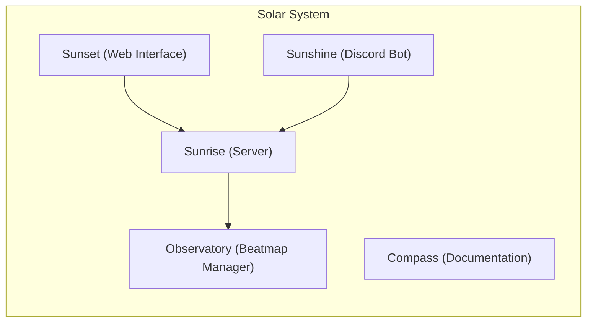

So, here you are, decided to host your own osu! server, and you stumbled upon Sunrise.

You might be wondering, what is Sunrise? Is it just another "[bancho.py](https://github.com/osuAkatsuki/bancho.py) powered" server? What makes it different?

In short - **No, it is not a bancho.py fork.**

But let's dive deeper into what Sunrise is and what it aims to achieve.

## Overview

Sunrise is a [C#](https://learn.microsoft.com/en-us/dotnet/csharp/)-based osu! server, written from the ground up, designed to be a modern and efficient alternative to existing servers like bancho.py.

It was originally created by <GithubUser username="ohaui" />, and later picked up by <GithubUser username="richardscull" /> who is now leading the project and maintaining it as part of the [Sunrise Community](https://github.com/SunriseCommunity).

### Ecosystem

"Sunrise" is not just a server; it's an ecosystem. It includes:

:::note
Sunrise is designed to be used with [Solar System Orchestrator](https://github.com/SunriseCommunity/Solar-System).
:::

- **[Sunrise](https://github.com/SunriseCommunity/Sunrise)**: The core server that handles game logic, player connections, and more. Pretty much the "brain" of the operation.
- **[Sunset](https://github.com/SunriseCommunity/Sunset)**: The face of the server. You can view it [here](https://sunrize.uk/). It provides a web interface for players to interact with the server, view their stats, and more.
- **[Observatory](https://github.com/SunriseCommunity/Observatory)**: Lightweight beatmap manager. It allows us to parse multiple beatmap mirrors and provides a way to manage beatmaps efficiently.
- **[Sunshine](https://github.com/SunriseCommunity/Sunshine)**: Discord bot that provides server information, player stats, and more. It acts as a bridge between the server and the Discord community.
- **[Compass](https://github.com/SunriseCommunity/Compass)**: You are currently reading it! This is the documentation for the Sunrise server.

It's planned in the future to have more advanced "bancho"-like bots registration, so we can give users ability to register their own bots, and have them interact with the server.  
(Think about any Twitch requests bot, tournament bot, etc.)

### Development Philosophy

Sunrise is built with the following principles in mind:

- **Lightweight**: The server is designed to be lightweight, this is why we don't store beatmaps in the database, but rather use a separate service (Observatory) to manage them.
- **Modular**: Each component of the ecosystem is designed to be modular, except for the core server. So you can create your own components and integrate them with the server using the provided APIs.
- **Test-Driven Development**: The core parts of the server are written with test-driven development in mind, ensuring that the code is reliable and maintainable.
- **Open Source**: All components of the Sunrise ecosystem are open source, allowing anyone to contribute, modify, and use them freely under the [MIT License](http://opensource.org/license/mit/).

## Closing Words

We hope this gives you a better understanding of what Sunrise is and what it aims to achieve.

If you more interested in the technical details of how the server works, check out the [Contributing](../contributing) section.

Now, let's get started with setting up the server and exploring its features!

export const GithubUser = ({ username }) => (
  
    
    <a href={`https://github.com/${username}`} style={{ fontSize: "0.875rem", lineHeight: "1.25rem", verticalAlign: "middle"  }}>
      {username}
    </a>
  
);
